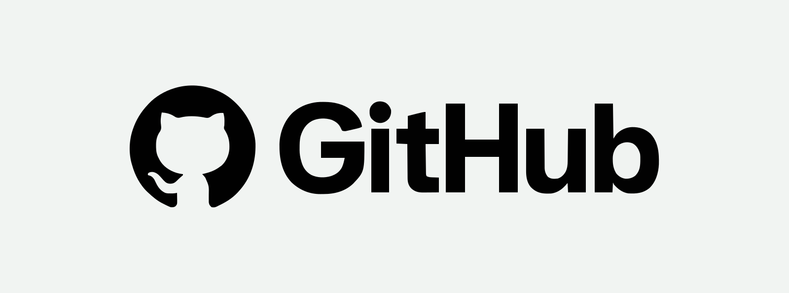
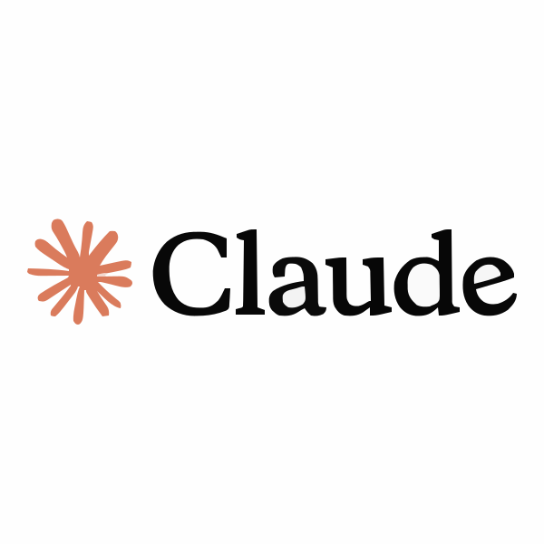

# Lead Technical Writer | Product, API & Developer Documentation

# About Me

A dynamic professional with **15+ years** of experience creating end-user and developer documentation. Excellent organization and communication skills, highly motivated, and strong at working within tight deadlines. Experienced across a wide range of authoring tools and both technical and non-technical document types.

# Education

**Bachelor of Technology (B.Tech.), Information Technology** 
[S.I.E.T, Anna University, Chennai](https://annauniv.edu/), 2007 – 2011

# Experience

<table>
<tr>
<td width="30%" valign="top"><strong>Lead Technical Writer</strong> <a href="https://www.browserstack.com/">BrowserStack</a> 2024 – Present</td>
<td width="70%">
<ul>
<li>Create and maintain user-friendly documentation using the Docs as Code approach with GitHub and VS Code.</li>
<li>Author product documentation for low-code automation features.</li>
<li>Used Claude and GitHub Copilot to streamline and accelerate documentation workflows.</li>
<li>Created reusable skills to achieve documentation consistency.</li>
</ul>
</td>
</tr>
<tr>
<td valign="top"><strong>Senior Technical Writer</strong> <a href="https://clevertap.com/">CleverTap</a> 2023 – 2024</td>
<td>
<ul>
<li>Authored and updated the User Guide, Developer Guide, and Release Notes.</li>
</ul>
</td>
</tr>
<tr>
<td valign="top"><strong>Senior Technical Writer</strong> <a href="https://www.dieboldnixdorf.com/en-us/">Diebold Nixdorf</a> 2021 – 2023</td>
<td>
<ul>
<li>Created Diebold Nixdorf Public API documentation.</li>
<li>Created API Reference documentation.</li>
<li>Created How-To Guides, API use cases, and sequence diagrams.</li>
</ul>
</td>
</tr>
<tr>
<td valign="top"><strong>Technical Documentation Lead</strong> <a href="https://www.sessionai.com/">ZineOne, Inc</a> 2020 – 2021</td>
<td>
<ul>
<li>Revamped the User Guide and Developer's Guide (SDK).</li>
<li>Documented ZineOne REST APIs.</li>
<li>Updated SDK documentation.</li>
<li>Created a Getting Started Guide.</li>
</ul>
</td>
</tr>
<tr>
<td valign="top"><strong>Senior Technical Writer</strong> <a href="https://www.smartstream-stp.com/">SmartStream Technologies</a> 2018 – 2020</td>
<td>
<ul>
<li>Updated User Guides, Release Notes, and the Administrator Guide.</li>
</ul>
</td>
</tr>
<tr>
<td valign="top"><strong>Technical Writer</strong> <a href="https://www.dieboldnixdorf.com/en-us">Diebold Nixdorf</a> 2014 – 2018</td>
<td>
<ul>
<li>Created Installation Guides, Configuration Guides, User Manuals, Release Notes, Product Bulletins, and API Guides.</li>
<li>Implemented ISO standards for the documentation team.</li>
</ul>
</td>
</tr>
<tr>
<td valign="top"><strong>Documentation Coordinator</strong> <a href="https://www.hp.com/in-en/">Hewlett-Packard</a> 2011 – 2014</td>
<td>
<ul>
<li>Created Standard Operating Procedures (SOP) for Windows, UNIX, and Storage technology.</li>
<li>Created Technical Operations Manuals, Technical Architecture Manuals, enterprise-wide rack diagrams, and data center maps for multiple projects.</li>
</ul>
</td>
</tr>
</table>

# Tools

  

# Work Samples

<b>🤖 Low Code Automation Product Documentation</b> — BrowserStack

 

Authored user-facing feature documentation for BrowserStack's Low Code Automation product, covering core test-recording capabilities and the newer AI-driven agentic testing workflow.

- [Test Email Workflows](https://www.browserstack.com/docs/low-code-automation/test-recording/test-email-workflows)
- [Conditional Flow (If-Else)](https://www.browserstack.com/docs/low-code-automation/test-recording/conditional-flow)
- [Loops](https://www.browserstack.com/docs/low-code-automation/test-recording/loops)
- [Agentic Testing (BrowserStack AI)](https://www.browserstack.com/docs/low-code-automation/test-recording/browserstack-ai/agentic-testing)

<b>🔗 Building API Reference Guide</b> — CleverTap

 

Played a pivotal role in accelerating progress on the API Reference Integration Project (GitHub–Readme sync) at CleverTap, in collaboration with the development team. Demonstrated exceptional problem-solving skills and proactive initiative, resulting in significant advancements in project milestones.

**Key contributions:**
- Verifying JSON collections
- Testing the API–GitHub sync
- Proposing solutions for rendering issues in API output
- Troubleshooting issues in YAML files
- Migrating API content from the Developer Guide to Readme.io

<b>📋 Use Case Documentation</b> — CleverTap

 

Proficient in analyzing and documenting various use case scenarios to enhance product functionality and user experience.

- [Use Case 1: Score a Customer](https://docs.clevertap.com/docs/use-case-1-score-a-customer-using-past-behaviour-segment-journey)
- [Use Case 2: Cart Abandonment](https://docs.clevertap.com/docs/use-case-2-recover-abandoned-cart-using-journeys)

<b>📄 User Documentation</b> — CleverTap

 

- [CSV Upload](https://docs.clevertap.com/docs/csv-upload)

<b>🔌 Integration Documentation</b> — CleverTap

 

- [Smart TV](https://developer.clevertap.com/docs/jio-tv-set-top-boxstb-integration-with-android-sdk)

<b>✍️ Technical Writing Test Papers</b> — CleverTap

 

Created Technical Writing test papers for CleverTap:

- [Junior Position](https://github.com/selvam-uma/selvam-uma/blob/main/Technical%20Writing%20Test/Technical%20Writing%20Test%20-%20Junior%20Position.pdf)
- [Senior Position](https://github.com/selvam-uma/selvam-uma/blob/main/Technical%20Writing%20Test/Technical%20Writing%20Test%20-%20Senior%20Position.pdf)

<b>🏦 Author API Documentation</b> — Diebold Nixdorf

 

Authored the following API documents at Diebold:

- [Banking API Platform, Campaign API, Version 1.0.0.pdf](https://github.com/selvam-uma/private-docs/blob/main/Banking%20API%20Platform%2C%20Campaign%20API%2C%20Version%201.0.0.pdf)
- [How to Request Access to an API-v1.pdf](https://github.com/selvam-uma/private-docs/blob/main/How%20to%20Request%20Access%20to%20an%20API-v1.pdf)

> **Note:** These are confidential documents.

<b>🔄 Document Revamp</b> — ZineOne / CleverTap

 

Skilled in improving documentation for better clarity and accessibility. Revamped the ZineOne User Guide and Dev Guide, as well as the Journey landing page, by reorganizing content and adding tutorial videos to enhance user experience.

- [ZineOne User Guide](https://docs.zineone.com/docs/concepts-and-components) — Revamped the entire doc set
- [ZineOne Dev Guide](https://devguide.zineone.com/docs/integrating-android-sdk) — Revamped the entire doc set
- [Journey](https://docs.clevertap.com/docs/journeys) — Revamped the landing page and added tutorial videos, resulting in positive customer upvotes on Readme

<b>🎥 Video Creation (Trainn Tool)</b> — CleverTap

 

Created engaging, informative videos using the Trainn tool. This resulted in a few upvotes (customer feedback) on Readme.

- [Journey Overview](https://docs.clevertap.com/docs/journeys#journey-overview-video-tutorial)
- [Journey Creation](https://docs.clevertap.com/docs/journeys#create-a-sample-journey-video-tutorial)
- [Scribe](https://docs.clevertap.com/docs/scribe#scribe-overview-video-tutorial)

<b>📱 Enhanced Landing Pages for SDK Documents</b> — CleverTap

 

Transformed the SDK landing page by introducing essential elements to provide users with comprehensive information — expanding beyond a basic overview to include SDK size, code size, integration high-level steps, and additional resources. This empowered users to make informed decisions and streamline their integration process, resulting in a few customer upvotes on Readme and a measurable reduction in customer tickets.

- [iOS](https://developer.clevertap.com/docs/ios)
- [Android](https://developer.clevertap.com/docs/android)

